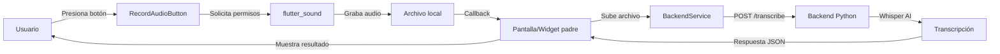

# 🎤 Speech-to-Text Integration

Guía completa del módulo de reconocimiento de voz para grabación de audio y transcripción automática.

---

## 📋 Descripción General

El módulo Speech-to-Text permite a los usuarios grabar audio directamente desde la aplicación y obtener transcripciones automáticas utilizando el backend de Python con Whisper AI. Esta funcionalidad está diseñada para integrarse en el flujo de reclamaciones (claims) y otros módulos que requieran entrada de voz.

### Características Principales

- ✅ Grabación de audio con límites de duración configurables
- ✅ Visualización en tiempo real del estado de grabación
- ✅ Transcripción automática vía API backend
- ✅ Manejo centralizado de errores con `ErrorHandler`
- ✅ Internacionalización completa (ES/EN)
- ✅ Permisos de micrófono gestionados automáticamente
- ✅ Pantalla de testing independiente

---

## 🏗️ Arquitectura

### Componentes del Frontend

```
lib/presentation/
├── widgets/audio/
│   └── record_audio_button.dart    # Widget reutilizable de grabación
└── screens/test/
    └── audio_recording_test_screen.dart  # Pantalla de pruebas
```

### Flujo de Datos



---

## 📦 Dependencias

### Flutter (pubspec.yaml)

```yaml
dependencies:
  flutter_sound: ^9.2.13
  permission_handler: ^11.0.1
  path_provider: ^2.1.1
```

### Backend Python

- FastAPI
- OpenAI Whisper
- FFmpeg (para procesamiento de audio)

---

## 🎯 Componentes Principales

### 1. RecordAudioButton

Widget reutilizable que encapsula toda la lógica de grabación de audio.

**Ubicación**: `lib/presentation/widgets/audio/record_audio_button.dart`

**Uso**:

```dart
RecordAudioButton(
  onRecordingComplete: (String audioPath) {
    // Manejar el audio grabado
    print('Audio guardado en: $audioPath');
  },
  maxDurationSeconds: 120, // 2 minutos
)
```

**Parámetros**:
- `onRecordingComplete`: Callback cuando se completa la grabación
- `maxDurationSeconds`: Duración máxima permitida (default: 60s)

**Estados**:
- `idle`: Esperando que el usuario inicie la grabación
- `recording`: Grabando audio (muestra temporizador)
- `stopped`: Grabación completada

**Características**:
- ✅ Gestión automática de permisos de micrófono
- ✅ Visualización del tiempo transcurrido
- ✅ Detención automática al alcanzar el límite
- ✅ Notificaciones de error con `ErrorHandler`
- ✅ Textos internacionalizados

### 2. AudioRecordingTestScreen

Pantalla standalone para probar la funcionalidad completa.

**Ubicación**: `lib/presentation/screens/test/audio_recording_test_screen.dart`

**Funcionalidades**:
- Grabación de audio
- Visualización de información del archivo (nombre, tamaño)
- Transcripción del audio
- Mostrar resultado de la transcripción
- Copiar transcripción al portapapeles
- Manejo de errores de transcripción

**Cómo acceder**:

Esta es una pantalla de testing temporal. Para acceder durante desarrollo:

```dart
Navigator.push(
  context,
  MaterialPageRoute(
    builder: (context) => const AudioRecordingTestScreen(),
  ),
);
```

> **TODO**: Esta pantalla es temporal. La funcionalidad debe integrarse en el flujo de claims.

---

## 🔌 Integración con Backend

### Endpoint de Transcripción

**URL**: `POST /api/v1/transcribe`

**Parámetros**:
- `file`: Archivo de audio (multipart/form-data)
- `user_id`: ID del usuario
- `language`: Código de idioma (ej: 'es', 'en')

**Respuesta exitosa**:

```json
{
  "transcription": "Texto transcrito del audio...",
  "language": "es",
  "duration": 45.2,
  "timestamp": "2025-12-14T17:30:00"
}
```

**Respuesta de error**:

```json
{
  "error": true,
  "message": "Error procesando el audio",
  "details": "..."
}
```

### BackendService

El servicio `BackendService` maneja la comunicación con el backend.

**Método principal**:

```dart
Future<TranscriptionResult> transcribeAudioFile({
  required String audioFilePath,
  required String userId,
  required String language,
}) async {
  // Implementación en lib/data/services/backend_service.dart
}
```

---

## 🌍 Internacionalización

### Claves i18n Utilizadas

Todas las cadenas de texto están internacionalizadas en `app_es.arb` y `app_en.arb`:

#### RecordAudioButton
- `recordAudio`: "Grabar Audio"
- `recording`: "Grabando..."
- `stopRecording`: "Detener"
- `recordingComplete`: "Grabación Completa"
- `recordingError`: "Error de Grabación"
- `microphonePermissionDenied`: "Permiso de micrófono denegado"
- `audioRecordingFailed`: "Falló la grabación de audio"

#### AudioRecordingTestScreen
- `audioTestTitle`: "Prueba de Audio"
- `audioTestSubtitle`: "Graba y transcribe audio"
- `recordingTest`: "Test de Grabación"
- `recordedAudio`: "Audio Grabado"
- `transcribeAudio`: "Transcribir Audio"
- `transcribing`: "Transcribiendo..."
- `transcription`: "Transcripción"
- `transcriptionCompleted`: "Transcripción Completada"
- `transcriptionError`: "Error de Transcripción"
- `noRecordingsYet`: "Aún no hay grabaciones"
- `textCopied`: "Texto copiado"
- `copyToClipboard`: "Copiar al portapapeles"

---

## 🧪 Testing

### Pantalla de Pruebas

1. Ejecutar la aplicación
2. Navegar a `AudioRecordingTestScreen`
3. Presionar el botón de grabación
4. Hablar al micrófono
5. Detener la grabación
6. Presionar "Transcribir Audio"
7. Verificar resultado

### Casos de Prueba

#### ✅ Caso 1: Grabación Exitosa
- **Pasos**: Grabar audio por 5 segundos
- **Resultado esperado**: Archivo guardado, tamaño mostrado

#### ✅ Caso 2: Transcripción Exitosa
- **Pasos**: Grabar, luego transcribir
- **Resultado esperado**: Texto transcrito mostrado correctamente

#### ✅ Caso 3: Permiso Denegado
- **Pasos**: Denegar permiso de micrófono
- **Resultado esperado**: Error mostrado con mensaje claro

#### ✅ Caso 4: Límite de Duración
- **Pasos**: Grabar más del tiempo permitido
- **Resultado esperado**: Grabación se detiene automáticamente

#### ✅ Caso 5: Error de Backend
- **Pasos**: Detener backend, intentar transcribir
- **Resultado esperado**: Error de conexión mostrado

---

## 🔧 Configuración

### Permisos de Android

En `android/app/src/main/AndroidManifest.xml`:

```xml
<uses-permission android:name="android.permission.RECORD_AUDIO" />
<uses-permission android:name="android.permission.WRITE_EXTERNAL_STORAGE" />
<uses-permission android:name="android.permission.READ_EXTERNAL_STORAGE" />
```

### Permisos de iOS

En `ios/Runner/Info.plist`:

```xml
<key>NSMicrophoneUsageDescription</key>
<string>Necesitamos acceso al micrófono para grabar notas de voz</string>
```

---

## 🚀 Integración en Claims (Futuro)

### Plan de Implementación

1. **Añadir botón en ClaimForm**
   ```dart
   RecordAudioButton(
     onRecordingComplete: (audioPath) {
       // Guardar audio en el claim
       _addAudioToClai m(audioPath);
     },
   )
   ```

2. **Guardar referencia en modelo Claim**
   ```dart
   class Claim {
     // ...
     String? audioFilePath;
     String? audioTranscription;
   }
   ```

3. **Mostrar transcripción en detalles**
   - Añadir sección de audio en `ClaimDetailScreen`
   - Mostrar transcripción si existe
   - Permitir re-transcribir si es necesario

---

## ⚠️ Consideraciones

### Seguridad
- Los archivos de audio se almacenan temporalmente en el dispositivo
- El backend debe validar el tipo y tamaño del archivo
- Implementar rate limiting en el endpoint de transcripción

### Performance
- Archivos de audio pueden ser grandes (1-5 MB)
- La transcripción puede tardar varios segundos
- Mostrar indicadores de progreso apropiados

### UX
- Solicitar permisos en el momento adecuado
- Dar feedback visual durante grabación
- Permitir cancelar operaciones largas

---

## 📝 Tareas Pendientes (TODO)

- [ ] Integrar en flujo de claims
- [ ] Añadir opción de reproducir audio grabado
- [ ] Implementar caché de transcripciones
- [ ] Añadir soporte para diferentes formatos de audio
- [ ] Implementar edición manual de transcripción
- [ ] Añadir métricas de uso del módulo
- [ ] Optimizar tamaño de archivos de audio

---

## 🐛 Troubleshooting

### Error: "Permiso de micrófono denegado"
**Solución**: Ir a configuración del dispositivo y habilitar permisos de micrófono para la app.

### Error: "Falló la grabación de audio"
**Solución**: 
1. Verificar que el micrófono esté funcionando
2. Reiniciar la aplicación
3. Verificar logs para más detalles

### Error: "Error de conexión al backend"
**Solución**:
1. Verificar que el backend esté corriendo
2. Comprobar la URL del backend en `BackendService`
3. Verificar conectividad de red

### Transcripción inexacta
**Solución**:
1. Hablar más claramente
2. Reducir ruido de fondo
3. Verificar que el idioma configurado sea correcto

---

## 📚 Referencias

- [flutter_sound Documentation](https://pub.dev/packages/flutter_sound)
- [OpenAI Whisper](https://openai.com/research/whisper)
- [Backend API Documentation](../../backend_python/README.md)

---

**Volver a**: [Guías](./README.md) | [Documentación Principal](../README.md)
